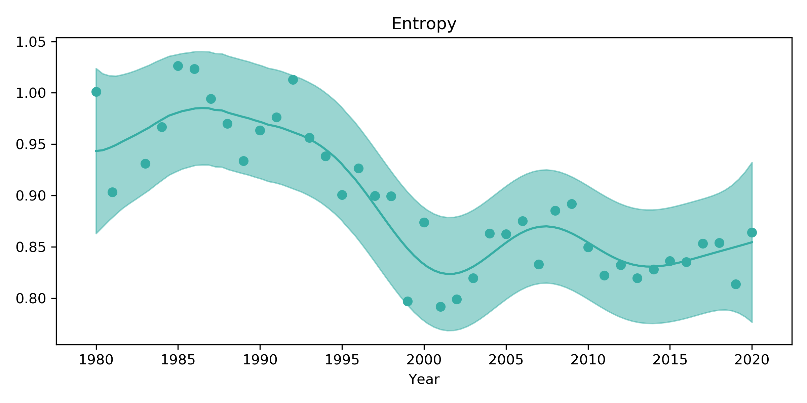

### Has tennis become more predictable? Charting tennis's styles over time using Latent Dirichlet Allocation

In these tennis-free days, I thought it would be fun to look back at the history of tennis and chart some general trends in playing style. 

For a while now, I have been meaning to apply a technique popular in natural language processing, Latent Dirichlet Allocation (LDA) to the data in the Match Charting Project (MCP). If you haven't heard of it, the MCP is a [monumental effort by many volunteers](http://www.tennisabstract.com/charting/meta.html) who watch tennis matches and painstakingly code up the sequence of shots and outcomes of each point. The MCP is by far the most complete source of information about tennis matches -- all other publicly available data sources are limited to, at most, shot-by-shot outcomes with limited or no detail about the rallies themselves.

### LDA in natural language processing

What is LDA? LDA was initially designed to find topics in collections of natural language documents (see for example the [original paper](http://www.jmlr.org/papers/volume3/blei03a/blei03a.pdf)). LDA takes as its input a number of *documents* -- these could be New York Times articles, for example. Each document is summarised by how often each word, or *term*, is mentioned in it. For example, if a document consisted only of the sentence "hello hello goodbye", it would be summarised by `(hello, 2), (goodbye, 1)`: hello appears twice, goodbye appears once.

LDA's central idea is a *topic*. A *topic* defines how probable each term is. In the New York Times articles, you might imagine that there is a "politics" topic which puts high probabilities on words like "politician", "congress", "election" and the like.

One natural idea, then, would be to assume that each document is generated from a single topic. This is a perfectly valid way to go and it would give rise to a *mixture model*. However, many documents deal with multiple topics. For example, you might imagine that the "politics" topic often appears in articles which also deal with economics. LDA takes this into account by modelling each article as a *mixture of topics*: a document could for example be 60% economics and 40% politics, which means that each word is 60% likely to be drawn from the economics topic and 40% likely to be drawn from the politics topic.

What does LDA do, then, in practical terms? Given a set of documents with their word counts and the number of topics to look for, LDA finds these topics -- distributions over words -- as well as how likely each document is to belong to each topic -- distributions over topics.

### LDA for the MCP

How can we apply LDA to the MCP? The key questions are what "words" and "documents" correspond to in tennis. This is a very good question, and I considered various options. The one I settled on, mainly because it was easiest to get started with since Jeff had [already summarised the data in a nice way](https://github.com/JeffSackmann/tennis_MatchChartingProject/blob/master/charting-m-stats-ShotTypes.csv), is the following:

* A *word* corresponds to a *shot type*. The MCP distinguishes 17 different basic shot types, such as forehand groundstroke, backhand groundstroke, forehand slice, forehand volley, and so on, just to name a few (more on these below).
* Each *document* corresponds to a *player/match combination*. So, for example, a Federer - Nadal match would give rise to two documents: one for Federer, summarised by how often he hit each shot type, and another one for Nadal.

Although I think this is a reasonable start, there are some obvious ways this assignment could be improved. A relatively simple addition, for example, would be to further categorise each shot type by the direction it was hit. Another idea would be to group shots into sets of two consecutive shots: for example, `(forehand cross-court, forehand cross-court)` would indicate that the player received a forehand cross-court and returned it back the same way, which might capture more details about how rallies develop.

Nevertheless, this was the easiest summary to produce, and as I hope you'll agree, I think it already produces some fairly interesting results.

### An example "document": Federer vs. Nadal, Wimbledon 2008

I thought I would illustrate the idea by taking a look at how the great Federer - Nadal Wimbledon match in 2008 is represented:

```
|                          |   Federer |   Nadal |
|:-------------------------|----------:|--------:|
| Forehand groundstroke    |       332 |     381 |
| Backhand groundstroke    |       234 |     222 |
| Backhand slice           |        85 |      37 |
| Backhand volley          |        18 |       2 |
| Forehand volley          |        13 |       4 |
| Backhand drop shot       |         7 |       3 |
| Backhand lob             |         5 |       3 |
| Forehand slice           |         5 |       5 |
| Forehand swinging volley |         3 |       0 |
| Forehand lob             |         3 |       0 |
| Standard overhead/smash  |         3 |       7 |
| Backhand half-volley     |         2 |       0 |
| Forehand half-volley     |         1 |       0 |
| Forehand drop shot       |         1 |       5 |
| Backhand swinging volley |         0 |       0 |
| Backhand overhead/smash  |         0 |       1 |
| Trick shot               |         0 |       0 |
```

Each column here represents one "document", and each row a "word". As you might expect, most shots in the match were groundstrokes, most of them on the forehand side. Federer hit more backhand slices and came to the net more often; Nadal hit more forehands. We'll revisit this example later on with the results obtained from LDA.

Overall, on the men's side, there are 4,938 such player/match documents. As you might expect, they are skewed towards the most famous players -- in particular, Federer alone makes up 417 -- but this is still an amazing resource. Hats off to the hard work of the MCP coders!

### Fitting LDA

One choice that has to be made when running LDA is how many topics to look for. I haven't delved into this deeply; as a first pass, I tried to pick the number of components that had the least "perplexity", a number easily calculated with the [implementation in scikit learn I was using](https://scikit-learn.org/stable/modules/generated/sklearn.decomposition.LatentDirichletAllocation.html). This suggested that 4 topics performed best when evaluated on the full dataset. I expected the number to be higher, and I am not completely confident in my approach to select the topics. My sense is that four topics might be overly simplifying matters, but the small number does have the advantage of being easier to interpret than, say, ten topics, so this is what I'm using in this initial look.

#### Topics

Here are the four topics discovered together with their probability distribution over shots. To make things a bit easier, I decided to give each a name. I also only list the shots that have the highest probability so as not clutter things too much.

* **Topic 1, "Baseline":** 54% backhand groundstrokes, 38% forehand groundstrokes.
* **Topic 2, "Volleying":** 28% backhand volley, 24% forehand volley, 18% backhand groundstroke, 10% forehand groundstroke, 6% standard smash, 4% backhand half-volley, 3% backhand slice, 3% forehand half-volley, 3% backhand lob.
* **Topic 3, "Forehand rally":** 84% forehand groundstroke, 7% backhand groundstroke, 4% backhand slice.
* **Topic 4, "Backhand slice":** 68% backhand slice, 17% forehand groundstroke, 6% forehand slice, 3% backhand groundstroke.

Where do Federer and Nadal at Wimbledon 2008 end up?

```
| player        |    1 |    2 |    3 |    4 |
|:--------------|-----:|-----:|-----:|-----:|
| Roger Federer | 0.54 | 0.06 | 0.27 | 0.14 |
| Rafael Nadal  | 0.54 | 0    | 0.42 | 0.04 |
```

We see that 54% of Federer and Nadal's shots were assigned to the "baseline rally" topic, so there is no difference between them there. However, Federer drew from the "volleying" topic 6% of the time, while Nadal hardly did at all, with his probability on that topic rounded to zero. Federer also used more of the backhand slice topic than Nadal. Interestingly, Nadal was able to make heavy use of the forehand topic. Finally, Federer used the "backhand slice" topic more often than Nadal.

#### Representative players for each topic

To get a better sense of each topic, I show the players who have the highest mean probability of using each in the table below. Here, I only include players who had at least 20 matches charted.

```
Topic 1: Baseline
| player          |    1 |    2 |    3 |    4 |
|:----------------|-----:|-----:|-----:|-----:|
| Daniil Medvedev | 0.89 | 0.02 | 0.07 | 0.01 |
| Karen Khachanov | 0.82 | 0.02 | 0.13 | 0.03 |
| Marat Safin     | 0.82 | 0.06 | 0.09 | 0.04 |
| Gael Monfils    | 0.8  | 0.03 | 0.12 | 0.05 |
| Andre Agassi    | 0.8  | 0.02 | 0.15 | 0.03 |

Topic 2: Volleying
| player           |    1 |    2 |    3 |    4 |
|:-----------------|-----:|-----:|-----:|-----:|
| Patrick Rafter   | 0.15 | 0.41 | 0.08 | 0.35 |
| Stefan Edberg    | 0.22 | 0.41 | 0.13 | 0.24 |
| John Mcenroe     | 0.32 | 0.38 | 0.13 | 0.18 |
| Boris Becker     | 0.43 | 0.34 | 0.07 | 0.16 |
| Goran Ivanisevic | 0.4  | 0.34 | 0.14 | 0.12 |

Topic 3: FH rally
| player           |    1 |    2 |    3 |    4 |
|:-----------------|-----:|-----:|-----:|-----:|
| Milos Raonic     | 0.36 | 0.09 | 0.39 | 0.15 |
| Grigor Dimitrov  | 0.38 | 0.01 | 0.35 | 0.26 |
| Denis Shapovalov | 0.54 | 0.05 | 0.33 | 0.08 |
| Feliciano Lopez  | 0.16 | 0.13 | 0.33 | 0.38 |
| Rafael Nadal     | 0.59 | 0.01 | 0.33 | 0.07 |

Topic 4: BH slice
| player          |    1 |    2 |    3 |    4 |
|:----------------|-----:|-----:|-----:|-----:|
| Ivo Karlovic    | 0    | 0.3  | 0.21 | 0.49 |
| Feliciano Lopez | 0.16 | 0.13 | 0.33 | 0.38 |
| Patrick Rafter  | 0.15 | 0.41 | 0.08 | 0.35 |
| Ivan Lendl      | 0.44 | 0.14 | 0.15 | 0.28 |
| Grigor Dimitrov | 0.38 | 0.01 | 0.35 | 0.26 |
```

Four out of the top five players in the baseline category had their best years in the 2000s and 2010s, as you might expect given the dominance of baseline tennis these days. These players have most of their weight on the baseline topic, and some on the forehand topic.

The top players in the volleying topic are a real blast from the past. These five each won Wimbledon at least once. Rafter stands out for making heavy use of the backhand slice, while Becker and Ivanisevic appear to have been a bit more content to rally from the baseline than the other three.

The top five in the forehand rally category are all active players. Raonic appears to be most eager to hit  forehands. Feliciano Lopez stands out for slicing more than the others, with Dimitrov coming second in this regard. Nadal almost exclusively uses the baseline and forehand topics.

Ivo Karlovic tops the backhand slice category. Does he ever hit flat / topspin backhands? Certainly some [highlights](https://www.youtube.com/watch?v=ZE5Mgxe_UjI) suggest he doesn't make a habit of it. The five highest-ranked players in this category all play single handed backhands, as you would expect. 

#### Evolution of topics over time

How have styles changed over time? To take a look at this, I decided to plot the mean topic probabilities for each year over time and smooth the result:


The most striking change here, to my mind, is that the "volleying" category has declined dramatically. In a way, that's stating the obvious -- everyone knows that serve & volley is a thing of the past. I found it quite interesting to see how early the decline began however. In the smoothed version, it looks like the volleying topic peaked around 1986 and really started to decline from around 1990, until it reached its current value of around 5% in about 2008. At the same time, as you might expect, the baselining category gained in popularity, from a low point of about 45% of shots in the mid-80s to its current value of about 60%.

It's also quite interesting that the "FH rally" topic, while always around, started increasing in around 2000 from an old value of around 14% of shots to its current value of about 23%. This might suggest that the tactic of trying to hit forehands as much as possible has increased since then.

I can't help but wonder how much of these changes are driven by the different factors fans like to speculate about. Kuerten famously won the 1997 [using Polyester strings](https://www.tennis.com/pro-game/2017/05/french-open-polyester-strings-gustavo-kuerten-roland-garros-atp-tennis/65921/), and apparently he wasn't the only one to use them by that time. These strings enabled players to hit with heavier topspin and are said to have made it easier to hit passing shots. Certainly the volleying category had already declined by then, down from about 25% in its heyday to only about 15%, so something had likely happened already. Fans also like to talk about surfaces becoming more similar over time. This doesn't seem as obvious to me in the figure since I (perhaps mistakenly?) think of that starting in the early 2000s, but it might have helped continue the decline of volleying during that decade.

Finally, to answer the title question of whether tennis has become more predictable, I look at the mean entropy of matches by year. Loosely speaking, entropy here is just a way of quantifying how spread out the probabilities are; for example, if all matches exclusively used one topic, the entropy would approach zero, while if all matches used all topics equally, the entropy would be about 1.39.



The chart suggests that entropy has declined over time and that players are more predictable in their use of topics. The decline appears to have started in the early 90s and really accelerated towards the end of the decade. That doesn't necessarily mean tennis is any less interesting, however: even within the baseline rallying topic, say, there are plenty of nuances not captured by this simple model.

I do want to point out however that while it is by far the best source we have, the MCP dataset is not necessarily a representative subset of matches. I haven't dug into the imbalances, but it's possible that more grass court matches were charted in the 80s than later on, for example, which could explain part of the early drop. It's also possible that the players charted are a particular subset, and that players who continued to serve & volley in the nineties are less popular with charters. So it's important to take these results with a grain of salt.

#### Conclusions

I hope you agree that this first look at the MCP data with LDA already produced some interesting results. There are plenty of extensions to LDA which might be interesting to apply, like [dynamic LDA](https://mimno.infosci.cornell.edu/info6150/readings/dynamic_topic_models.pdf), which models how topics evolve over time and even [tries to work out which documents changed topics](http://www.cs.columbia.edu/~blei/papers/GerrishBlei2010.pdf). Within LDA, as I mentioned, I would like to explore using more topics or perhaps setting the number automatically using [hierarchical topic models](http://www.cs.columbia.edu/~blei/papers/BleiGriffithsJordanTenenbaum2003.pdf), as well as including more detail about the rallies. There are lots of interesting things to do here!
